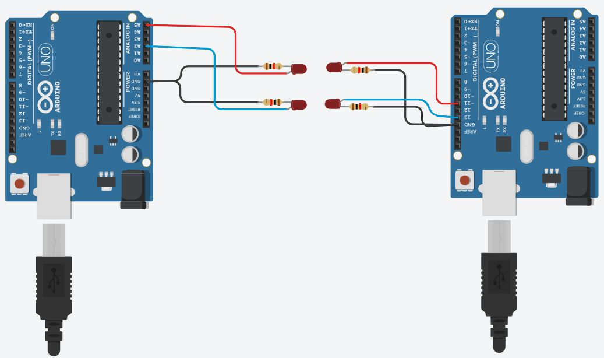
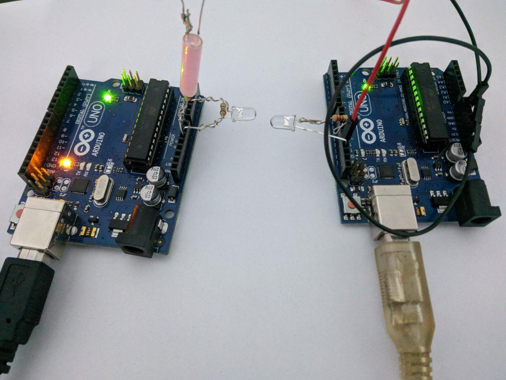

# LiFi-Proof-of-Concept
A proof of concept for communication using light in open air using led's and arduino.

 
   
  

## How-To Hardware
### Components
  * Arduino Uno - 2
  * Two pairs of LED's are used. One as a clock for data synchronisation and other for data transmission.
  * LED specs vary widely, it is recommended to use similar LEDs. 10mm blue colored leds were used.

### Pin Usage
#### Sender
  * Clock pin no. - 13
  * Data pin no. - 11
#### Getter
  * Clock pin no. - 5
  * Data pin no. - 2
##### Notes
  * Use proper LED resistors to limit the current.
  
  
## How-To Software
  * Load both programs onto two Arduino Uno boards.
  * Open the CLI and set the baud rate to 115200.
  * Input a string into the sender CLI, reciever should start printing out the characters.
##### Notes
  * Detection thershold is set to 300 - Value changes for LED type used.

## Data Frame

## CLI Screenshots

 
   
  

###### Reva University - Minor Project 2018 (Class of 2019 C&IT)
